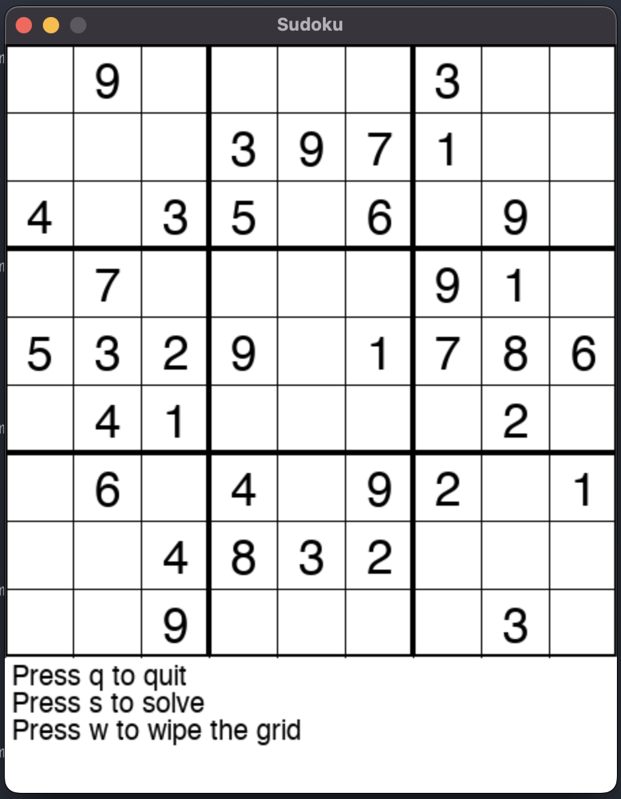

# Sudoku
A simple program to play a sudoku.

This is a fun project I come back to it from time to time to improve it feel free to copy and use this code as you want ;)

Here is a screenshot of what it look like:

# Setup
- Init venv : `python -m venv .venv`
- Activate venv : `source .venv/bin/activate`
- Install requirements : `pip install -r requirements.txt`
- Deactivate venv : `deactivate`

# Usage
- Run the solver : `python sudoku`
- Run test : `python -m unittest discover sudoku`
